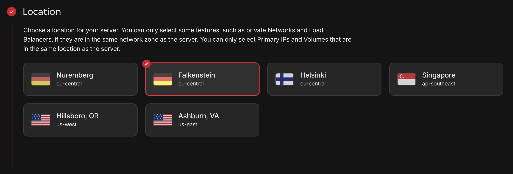
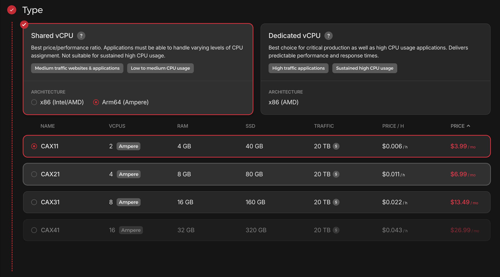
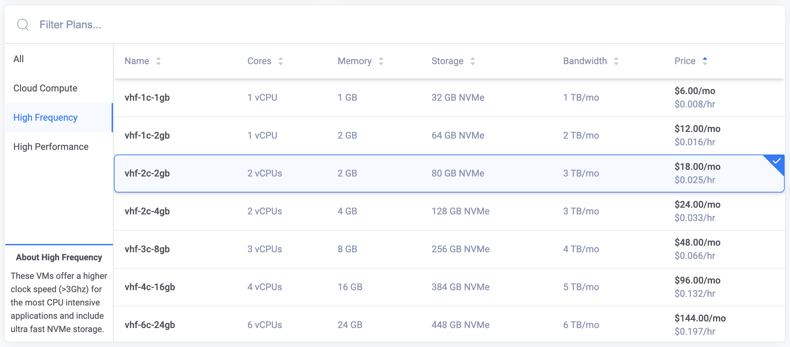

# Choosing the Right Hosting Environment

Selecting the right hosting provider is **crucial** for achieving a high-performance WordPress website. Many people focus on CPU and RAM, but the **truth is that network speed, port quality, and overall stability matter far more for a well-optimized WordPress site**.

Why? Because **WordPress relies heavily on caching**. Once a page is cached, it requires minimal CPU and RAM resources to serve. Instead, the bottleneck becomes **network performance**—how fast cached pages and assets can be delivered to users. If your server has a slow or unstable network, **even the most powerful CPU and highest RAM won’t save you** from poor performance.

## Why Network Speed Matters More than CPU & RAM

1. **Cache Reduces CPU & RAM Usage**
   - With proper page caching (e.g., LiteSpeed Cache, or Cloudflare cache), most WordPress requests **don’t even touch PHP or MariaDB**.
   - Cached pages are static and lightweight, requiring very little processing power to serve.

2. **Slow Network = Slow Website**
   - If your server has a **low-speed or congested network**, cached pages and static assets (CSS, JS, images) take longer to load, even if your CPU is fast.
   - A **high-quality, high-speed network** ensures faster delivery, reducing TTFB (Time to First Byte) and improving Core Web Vitals.

3. **High Traffic Needs Strong Network Bandwidth**
   - A slow network can become a bottleneck when handling high traffic. A **10Gbps network port** ensures that your site can handle thousands of concurrent users without slowdowns.

4. **CDNs Can Help, But a Good Network is Still Critical**
   - Using a CDN (like Cloudflare) helps, but the **origin server’s network quality still affects performance**.
   - A fast server with a **strong network** improves CDN performance by reducing latency between the server and CDN edge locations.

For these reasons, **network speed and port quality should be your #1 priority** when selecting a VPS or cloud server for WordPress hosting.

## Best VPS and Cloud Hosting Providers

Now, let’s compare the best VPS and cloud hosting providers based on **network performance, cost, and reliability**.

### 1. Hetzner (Best Value for Money, Weak Support)
- **Best for:** Budget-conscious users who need a **10Gbps network** at a low price and can manage servers independently.
- **Pros:**
  - **10Gbps network port** on even the cheapest plans.
  - Extremely affordable pricing for the performance.
  - Good for experienced users who don’t need support.
- **Cons:**
  - **Weak support** – slow, unhelpful, and unreliable.
  - Limited global locations (Germany, USA, Finland, Singapore).

**🔥 Hetzner Data Center Locations:**

**🔥 Best Hetzner Deal:**
  

🔥 **Best Hetzner Deal:**
- **Ampere ARM64 Server**
  - **2 vCPU / 4GB RAM / 40GB SSD**
  - **$3.99/month** (best price-to-performance ratio for a high-speed network)

If you can handle your own server management, **Hetzner is an unbeatable value**—but don’t expect reliable support.

### 2. Vultr & AWS (Better Reliability, Higher Cost, Faster Network)
- **Best for:** Users who need a **stable, fast, and globally available network**.
- **Pros:**
  - **Vultr and AWS has a faster network compared to Hetzner.**
  - Global data centers for better regional performance.
  - More reliable uptime and better customer support.
- **Cons:**
  - More expensive than Hetzner.
  - AWS pricing is complex, and overages can be costly.

💰 **Vultr Pricing:**
 

💰 **Pricing:**
- **Vultr / AWS**: Expect to pay **$12+/month** for a good VPS with decent resources.

If network **stability and speed** are your top priorities and budget isn’t a concern, **Vultr and AWS are better choices than Hetzner**.

## Key Factors for Choosing a VPS

To summarize, here’s what really matters when selecting a VPS for WordPress:

1. **Network Speed & Port Quality**
   - A **10Gbps port** is significantly better than a 1Gbps connection.
   - Vultr generally offers better network speeds than Hetzner.

2. **Stability & Uptime**
   - If reliability is critical, AWS and Vultr have stronger uptime guarantees than Hetzner.

3. **Server Location**
   - Choose a data center **close to your audience** for lower latency.

4. **Hardware Performance**
   - Modern **CPUs and NVMe storage** provide the best speed improvements.

## My Recommendation

If you want **the best performance for the lowest cost**, go with **Hetzner’s Ampere ARM64 VPS ($3.99/month)**. It has a **10Gbps network port** and excellent pricing, but **weak support**.

If you need **better reliability, global locations, and a faster network**, **Vultr or AWS** is a better choice—but expect to pay **$12+/month**.

---

Now that we’ve covered hosting, let’s move on to **Server Configuration** to set up the perfect WordPress environment. 🚀