# Configuring LiteSpeed Cache for WordPress

LiteSpeed Cache is a high-performance caching plugin specifically designed for WordPress sites running on LiteSpeed Web Server. This guide will walk you through installing and configuring LSCache with optimal settings for WordPress.

## Step 1: Install LiteSpeed Cache Plugin

1. Log in to your WordPress dashboard.
2. Go to **Plugins → Add New**.
3. Search for "LiteSpeed Cache".
4. Click **Install Now**, then **Activate**.


## Step 2: Configure General Settings

Navigate to **LiteSpeed Cache → Settings** and configure the following settings in the **General** tab:

### General Settings

- **Automatically Upgrade:** **OFF**
  - *Prevents automatic plugin updates*
- **Domain Key:** *Leave empty*
  - *Not required for basic setup*
- **Guest Mode:** **ON**
  - *Enables optimization for guest visitors*
- **Guest Optimization:** **ON**
  - *Applies optimization settings for guest visitors*
- **Server IP:** *Enter your server IP address*
  - *Required for proper communication with LiteSpeed server*
- **Notifications:** **ON**
  - *Enables admin notifications*

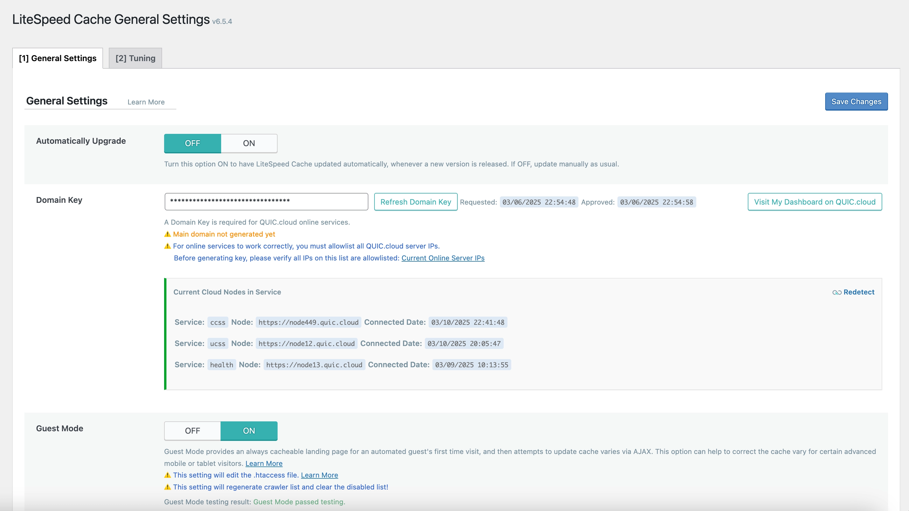

## Step 3: Configure Cache Settings

Navigate to **LiteSpeed Cache → Cache** and configure the following settings:

### Cache Tab

- **Enable Cache:** **ON**
  - *Activates the caching functionality*
- **Cache Logged-in Users:** **OFF**
  - *Don't cache pages for logged-in users*
- **Cache Commenters:** **ON**
  - *Cache pages for users who have commented*
- **Cache REST API:** **ON**
  - *Cache REST API requests*
- **Cache Login Page:** **ON**
  - *Cache the login page*
- **Cache PHP Resources:** **ON**
  - *Cache PHP generated resources*
- **Cache Mobile:** **ON**
  - *Cache mobile device views*

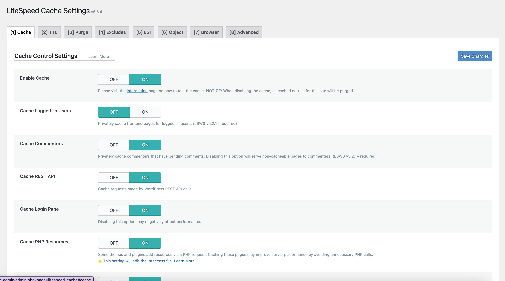

### TTL Tab

- *Keep all settings at their default values*

### Purge Tab

- **Purge All On Upgrade:** **ON**
  - *Clears all cache when WordPress is upgraded*
- **Auto Purge Rules For Publish/Update:** *Keep default settings*
- **Serve Stale:** **ON**
  - *Serves stale cache when generating new cache*

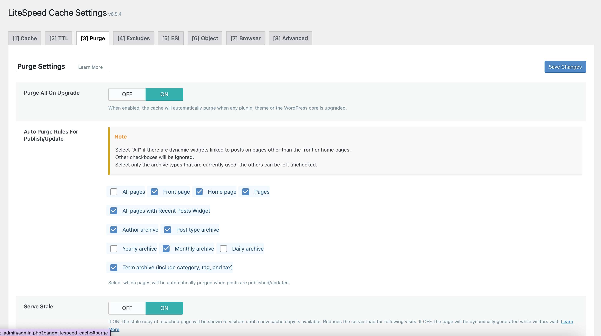

### Exclude Tab

- *Keep all settings at their default values*

### ESI Tab

- *Keep all settings at their default values*

### Browser Tab

- **Browser Cache:** **ON**
  - *Enables browser caching*
- **Browser Cache TTL:** **31557600**
  - *Sets browser cache time to live to 1 year (in seconds)*

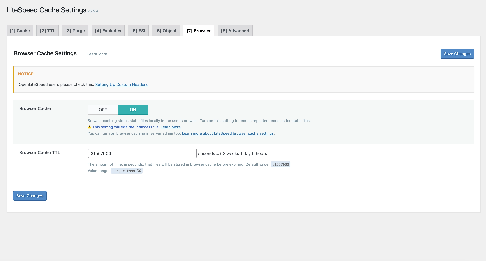

## Step 4: Configure OpenLiteSpeed for Browser Cache TTL

To ensure browser cache TTL is correctly set, you need to configure OpenLiteSpeed:

1. Access your OpenLiteSpeed admin panel at `<your-server-ip>:7080`
2. Go to **Virtual Hosts → choose your domain → Context tab**
3. Click the **Add (+)** icon
4. Set the **Type** to **Static**
5. Click **Next**
6. Fill out the following:

   - **URI:** `exp:^.*(css|gif|ico|jpeg|jpg|js|png|webp|avif|woff|woff2|fon|fot|ttf)$`
   
   - **Expires by Type:** 
     ```
     text/css=A15552000, image/gif=A15552000, image/x-icon=A15552000, image/jpeg=A15552000, application/x-javascript=A15552000, text/javascript=A15552000, application/javascript=A15552000, image/png=A15552000, image/webp=A15552000, image/avif=A15552000, font/ttf=A15552000, font/woff=A15552000, font/woff2=A15552000, application/x-font-ttf=A15552000, application/x-font-woff=A15552000, application/font-woff=A15552000, application/font-woff2=A15552000
     ```
   
   - **Header Operations:**
     ```
     unset Cache-control
     set Cache-control public, max-age=15552000
     ```
   
   - **Location:** `$DOC_ROOT/$0`
   - **Accessible:** Yes
   - **Enable Expire:** Yes

7. Click **Save**
8. On the main page of the panel, click the **Restart** button to restart OpenLiteSpeed

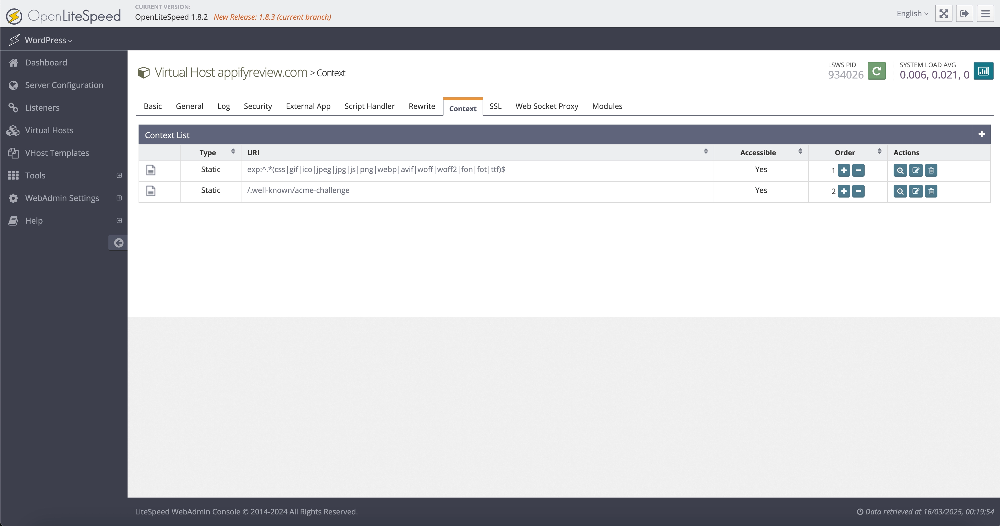

### Advanced Tab

- *Keep all settings at their default values*

## Step 5: Configure CDN Settings

Navigate to **LiteSpeed Cache → CDN** and configure the following settings:

### CDN Settings Tab

- **QUIC.cloud CDN:** **OFF**
  - *Don't use QUIC.cloud CDN*
- **Use CDN Mapping:** **OFF**
  - *Don't use CDN mapping*
- **Cloudflare API:** **ON**
  - *Enable Cloudflare integration*
  - Fill out:
    - **Global API Key / API Token**
    - **Email Address**
    - **Domain**

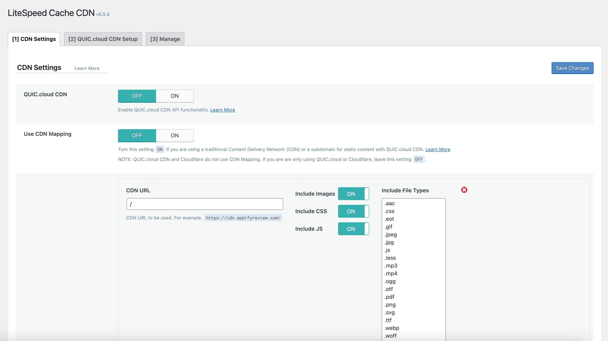

## Step 6: Configure Image Optimization Settings

Navigate to **LiteSpeed Cache → Image Optimization** and configure the following settings:

### Image Optimization Settings Tab

- *Turn OFF all options*
  - *We handle image optimization with ShortPixel plugin*

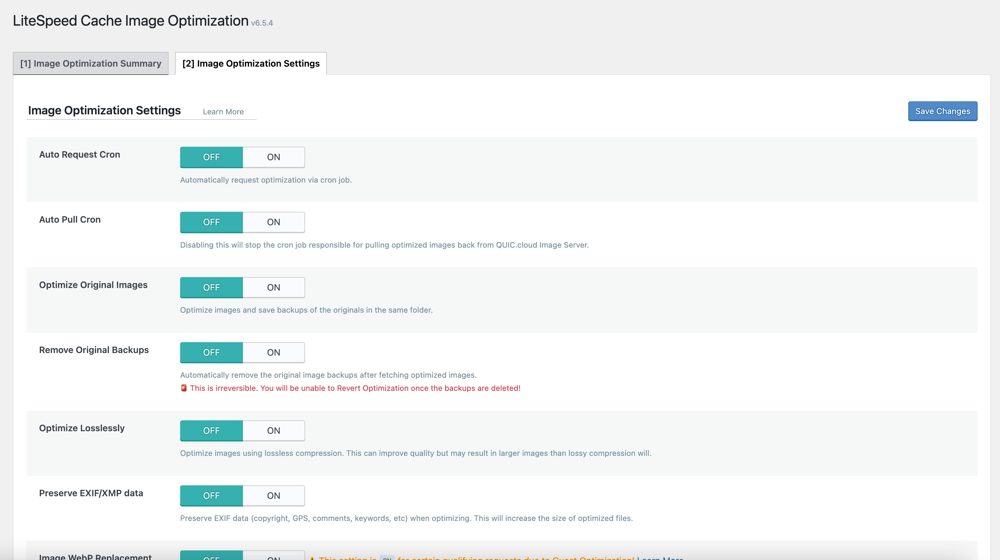

## Step 7: Configure Page Optimization Settings

Navigate to **LiteSpeed Cache → Page Optimization** and configure the following settings:

### CSS Settings Tab

- *Turn OFF all options*
  - *We handle CSS optimization with Perfmatters plugin*

### JS Settings Tab

- *Turn OFF all options*
  - *We handle JavaScript optimization with Perfmatters plugin*

### HTML Settings Tab

- **HTML Minify:** **ON**
  - *Minifies HTML output*
- **DNS Prefetch Control:** **ON**
  - *Controls DNS prefetching*
- **Remove Query Strings:** **ON**
  - *Removes query strings from static resources*
- **Load Google Fonts Asynchronously:** **OFF**
  - *Don't load Google Fonts asynchronously*
- **Remove Google Fonts:** **OFF**
  - *Don't remove Google Fonts*
- **Remove WordPress Emoji:** **ON**
  - *Removes WordPress emoji scripts*
- **Remove Noscript Tags:** **ON**
  - *Removes noscript tags*

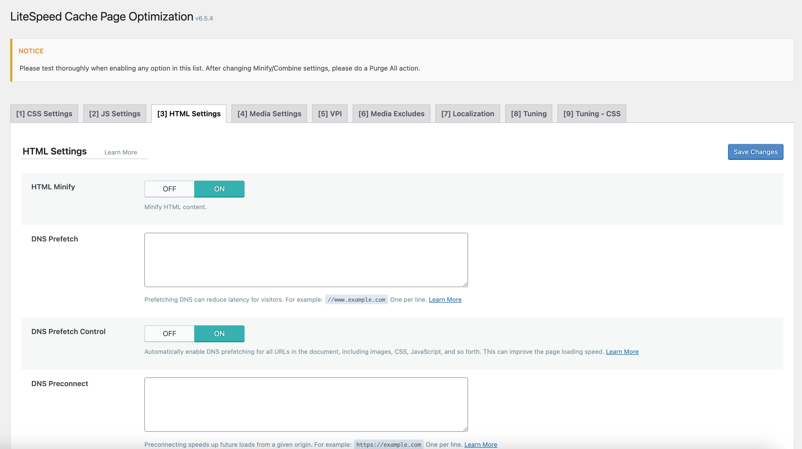

### Media Settings Tab

- *Turn OFF all options*
  - *We handle media optimization with WordPress native lazy load*

### Viewport Images Tab

- **Viewport Images:** **OFF**
  - *Don't use viewport-based image loading*
- **Viewport Images Cron:** **OFF**
  - *Don't use cron for viewport images*

### Localization Settings Tab

- **Gravatar Cache:** **ON**
  - *Cache Gravatar images locally*
- **Gravatar Cache Cron:** **ON**
  - *Use cron to update Gravatar cache*
- **Gravatar Cache TTL:** **604800**
  - *Set Gravatar cache time to live to 1 week (in seconds)*
- **Localize Resources:** **OFF**
  - *Don't localize external resources*

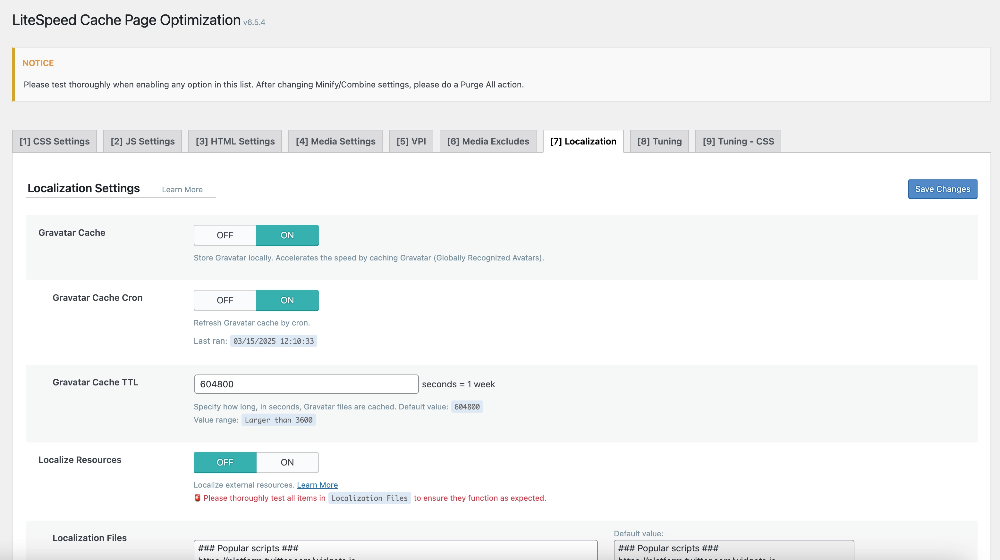

### Tuning Settings Tab

- **Optimize for Guests Only:** **ON**
  - *Apply optimization only for guest visitors*

### Tuning Settings - CSS Tab

- *Keep all settings at their default values*

## Step 8: Configure Crawler Settings

Navigate to **LiteSpeed Cache → Crawler** and configure the following settings:

### General Settings Tab

- **Crawler:** **ON**
  - *Enable the crawler functionality*
- **Delay:** **0**
  - *No delay between requests*
- **Run Duration:** **300**
  - *Run crawler for 5 minutes (in seconds)*
- **Interval Between Runs:** **600**
  - *Wait 10 minutes between crawler runs (in seconds)*
- **Crawl Interval:** **300**
  - *Crawl the same URL every 5 minutes (in seconds)*
- **Threads:** **5**
  - *Use 5 concurrent crawler threads*
- **Timeout:** **30**
  - *Set request timeout to 30 seconds*
- **Server Load Limit:** **1**
  - *Limit server load to 1*

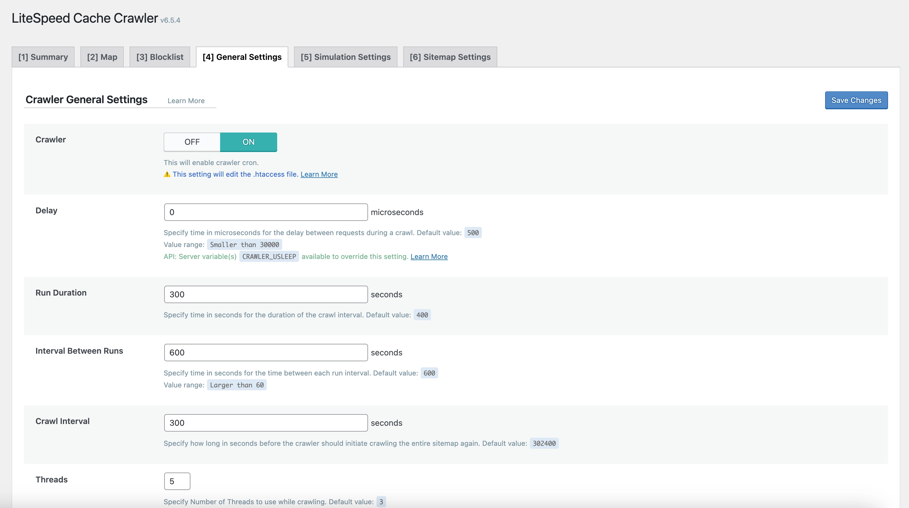

### Sitemap Settings Tab

- **Custom Sitemap:** *Enter your sitemap URL*
  - *Example: `<domain>/wp-sitemap.xml` or `<domain>/sitemap.xml`*
- **Drop Domain from Sitemap:** **ON**
  - *Remove domain from sitemap URLs*
- **Sitemap Timeout:** **120**
  - *Set sitemap fetch timeout to 120 seconds*

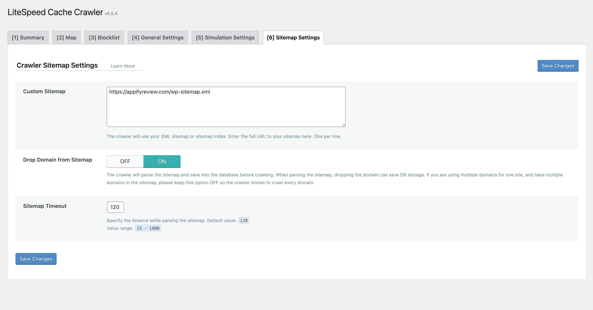

## Conclusion

With LiteSpeed Cache properly configured, your WordPress site will benefit from:

- Faster page load times
- Reduced server load
- Improved Core Web Vitals scores
- Better user experience
- Higher search engine rankings

Remember that LiteSpeed Cache works best on LiteSpeed Web Server, and these settings are optimized to work alongside ShortPixel for image optimization and Perfmatters for JavaScript and CSS optimization.

After configuring LiteSpeed Cache, test your website thoroughly to ensure everything is working correctly. You can use tools like Google PageSpeed Insights or GTmetrix to verify the performance improvements. 