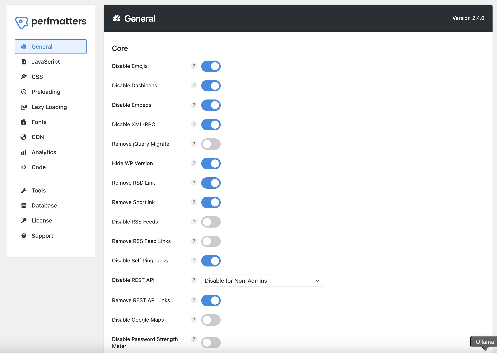
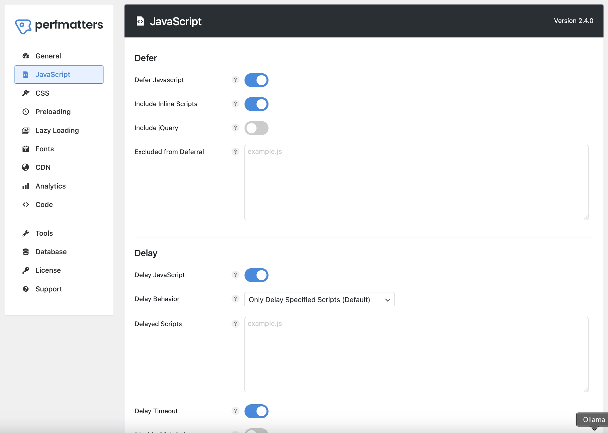
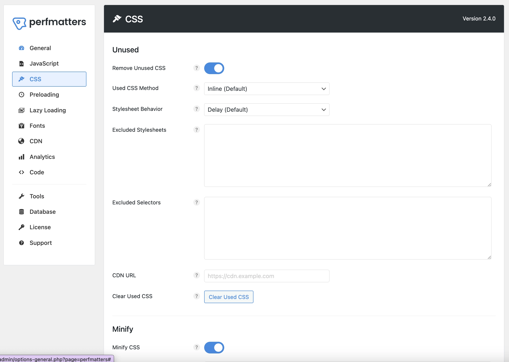
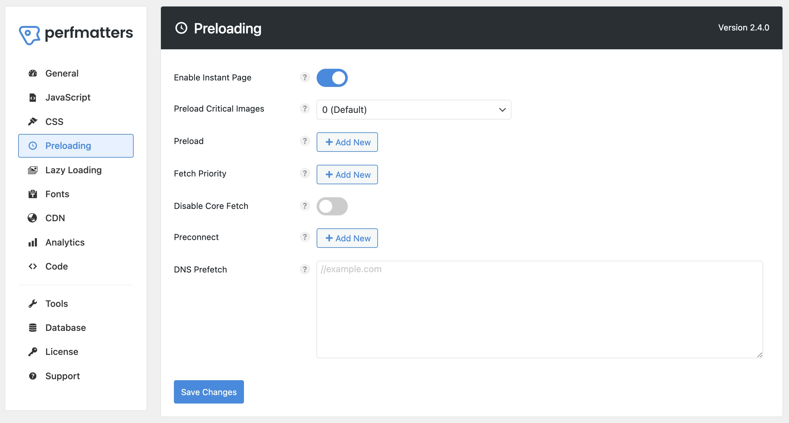
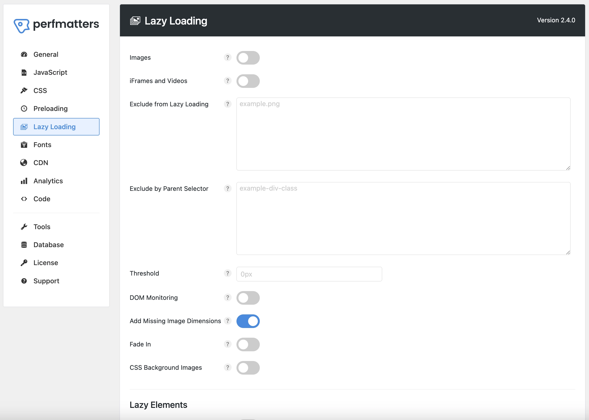
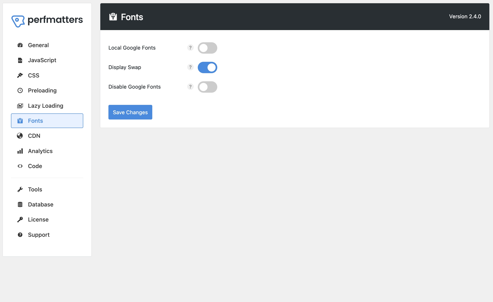
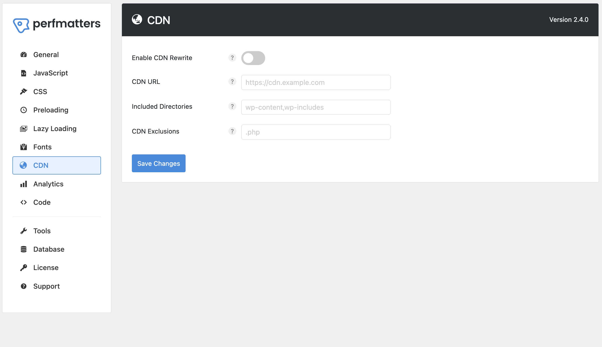
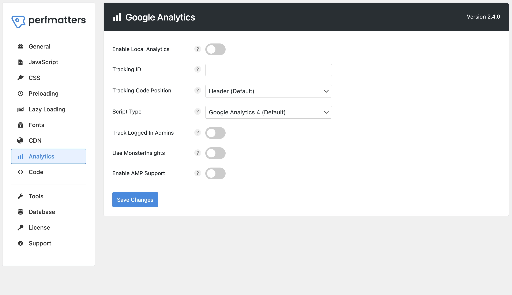
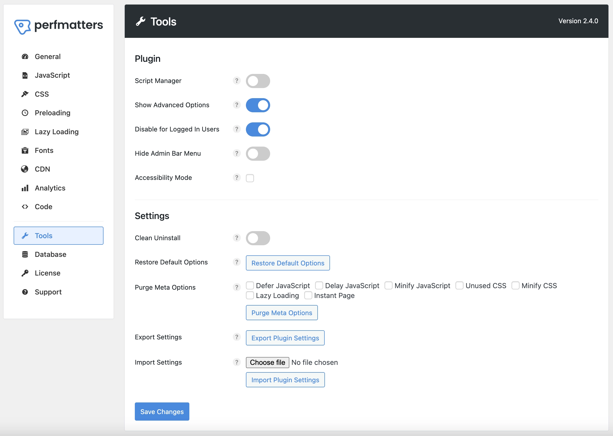

# Configuring Perfmatters for WordPress Optimization

Perfmatters is a powerful WordPress optimization plugin that helps improve your site's performance by disabling unnecessary features and optimizing various aspects of WordPress. This guide will walk you through installing and configuring Perfmatters with optimal settings for WordPress.

## Step 1: Install Perfmatters

1. Log in to your WordPress dashboard.
2. Go to **Plugins → Add New**.
3. Search for "Perfmatters".
4. Click **Install Now**, then **Activate**.

## Step 2: Configure General Settings

Navigate to **Settings → Perfmatters** and configure the following settings in the **General** tab:

### WordPress Features to Disable

- **Disable Emojis:** **ON**
  - *Removes WordPress emoji scripts and styles*
- **Disable Dashicons:** **ON**
  - *Removes WordPress admin icons for non-admin users*
- **Disable Embeds:** **ON**
  - *Removes WordPress embed functionality*
- **Disable XML-RPC:** **ON**
  - *Disables XML-RPC for security*
- **Remove jQuery Migrate:** **OFF**
  - *Keep jQuery Migrate for compatibility*
- **Hide WP Version:** **ON**
  - *Removes WordPress version from various locations*
- **Remove RSD Link:** **ON**
  - *Removes Really Simple Discovery link*
- **Remove Shortlink:** **ON**
  - *Removes shortlink meta tag*
- **Disable RSS Feeds:** **OFF**
  - *Keep RSS feeds enabled*
- **Remove RSS Feed Links:** **OFF**
  - *Keep RSS feed links*
- **Disable Self Pingbacks:** **ON**
  - *Prevents WordPress from sending pingbacks to your own site*
- **Disable REST API:** **Disable for Non-Admins**
  - *Restricts REST API access to administrators only*
- **Remove REST API Links:** **ON**
  - *Removes REST API links from the header*
- **Disable Google Maps:** **OFF**
  - *Keep Google Maps functionality*
- **Disable Password Strength Meter:** **OFF**
  - *Keep password strength meter*
- **Disable Comments:** **OFF**
  - *Keep comments functionality*
- **Remove Comment URLs:** **ON**
  - *Removes comment author URLs*
- **Add Blank Favicon:** **OFF**
  - *Don't add a blank favicon*
- **Remove Global Styles:** **OFF**
  - *Keep global styles*
- **Separate Block Styles:** **ON**
  - *Separates block styles for better performance*

### WordPress Heartbeat and Autosave Settings

- **Disable Heartbeat:** **Default**
- **Heartbeat Frequency:** **15 Seconds (Default)**
- **Limit Post Revisions:** **Default**
- **Autosave Interval:** **1 Minute (Default)**

## Step 3: Configure JavaScript Settings

In the **JavaScript** tab:

- **Defer JavaScript:** **ON**
  - *Defers JavaScript loading for better performance*
- **Include Inline Scripts:** **ON**
  - *Includes inline scripts in defer*
- **Delay JavaScript:** **ON**
  - *Delays JavaScript execution*
- **Delay Behavior:** **Only Delay Specified Scripts (Default)**
  - *Delays only specified scripts*
- **Delay Timeout:** **ON**
  - *Enables timeout for delayed scripts*
- **Minify JavaScript:** **ON**
  - *Minifies JavaScript files*

## Step 4: Configure CSS Settings

In the **CSS** tab:

- **Remove Unused CSS:** **ON**
  - *Removes unused CSS from your site*
- **Used CSS Method:** **Inline (Default)**
  - *Inlines critical CSS*
- **Stylesheet Behavior:** **Delay (Default)**
  - *Delays non-critical CSS*
- **Minify CSS:** **ON**
  - *Minifies CSS files*

## Step 5: Configure Preloading Settings

In the **Preloading** tab:

- **Enable Instant Page:** **ON**
  - *Enables instant page loading*
- **Preload Critical Images:** **0 (Default)**
  - *No preloading of critical images*

## Step 6: Configure Lazy Loading Settings

In the **Lazy Loading** tab:

- **Images:** **OFF**
  - *Disabled because we handle it with ShortPixel*
- **iFrames and Videos:** **OFF**
  - *Disabled because we handle it with ShortPixel*
- **DOM Monitoring:** **OFF**
  - *Disabled because we handle it with ShortPixel*
- **Add Missing Image Dimensions:** **ON**
  - *Adds missing image dimensions to prevent CLS*
- **Fade In:** **OFF**
  - *Disabled fade-in effect*
- **CSS Background Images:** **OFF**
  - *Disabled for CSS background images*
- **Elements:** **OFF**
  - *Disabled for custom elements*

## Step 7: Configure Font Settings

In the **Fonts** tab:

- **Local Google Fonts:** **OFF**
  - *Don't localize Google Fonts*
- **Display Swap:** **ON**
  - *Enables font display swap*
- **Disable Google Fonts:** **OFF**
  - *Keep Google Fonts enabled*

## Step 8: Configure CDN Settings

In the **CDN** tab:

- **Enable CDN Rewrite:** **OFF**
  - *Don't rewrite URLs to CDN*

## Step 9: Configure Google Analytics Settings

In the **Google Analytics** tab:

- **Enable Local Analytics:** **OFF**
  - *Don't localize Google Analytics*
- **Tracking Code Position:** **Header (Default)**
  - *Place tracking code in header*
- **Script Type:** **Google Analytics 4 (Default)**
  - *Use GA4 tracking code*
- **Track Logged In Admins:** **OFF**
  - *Don't track admin users*
- **Use MonsterInsights:** **OFF**
  - *Don't use MonsterInsights*
- **Enable AMP Support:** **OFF**
  - *Don't enable AMP support*

## Step 10: Configure Tools Settings

In the **Tools** tab:

- **Script Manager:** **OFF**
  - *Don't enable script manager*
- **Show Advanced Options:** **ON**
  - *Show advanced configuration options*
- **Disable for Logged In Users:** **ON**
  - *Disable optimizations for logged-in users*
- **Hide Admin Bar Menu:** **OFF**
  - *Keep admin bar menu visible*
- **Accessibility Mode:** **un-checked**
  - *Don't enable accessibility mode*

## Conclusion

With Perfmatters properly configured, your WordPress site will be more efficient and perform better. These settings:
- Remove unnecessary WordPress features
- Optimize JavaScript and CSS loading
- Improve page load times
- Reduce server load
- Enhance security

Remember to test your site after applying these settings to ensure everything works as expected. If you encounter any issues, you can easily revert specific settings in the Perfmatters dashboard. 