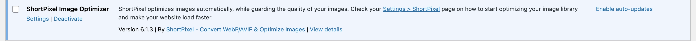
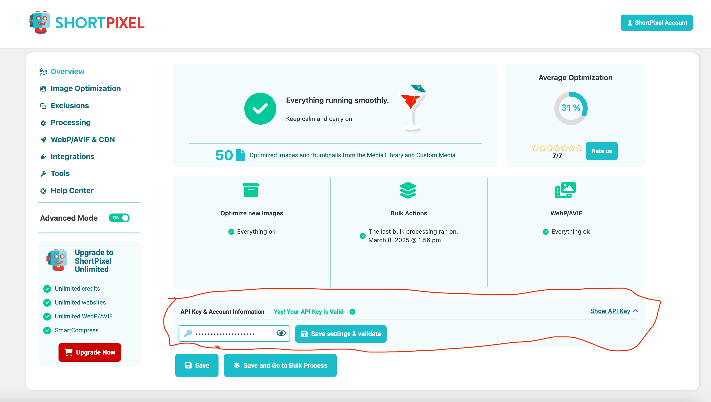
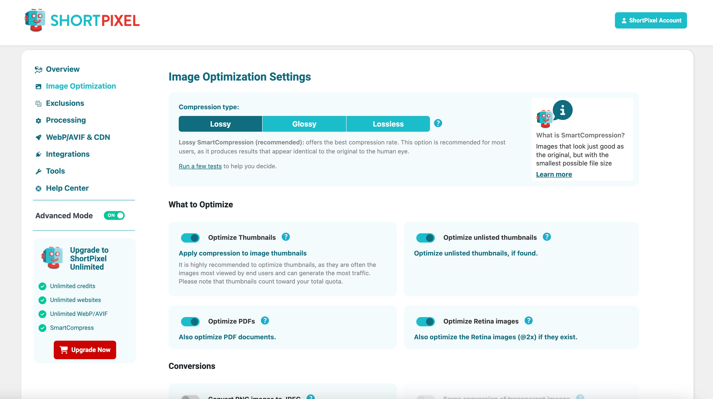
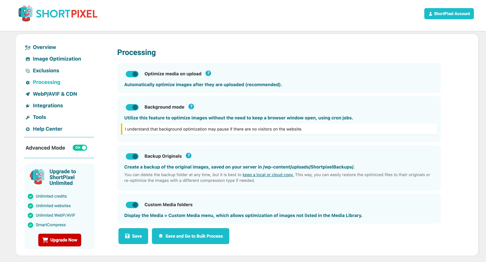
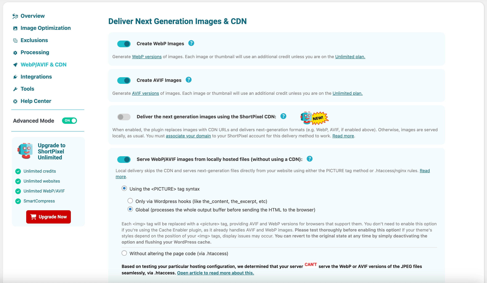
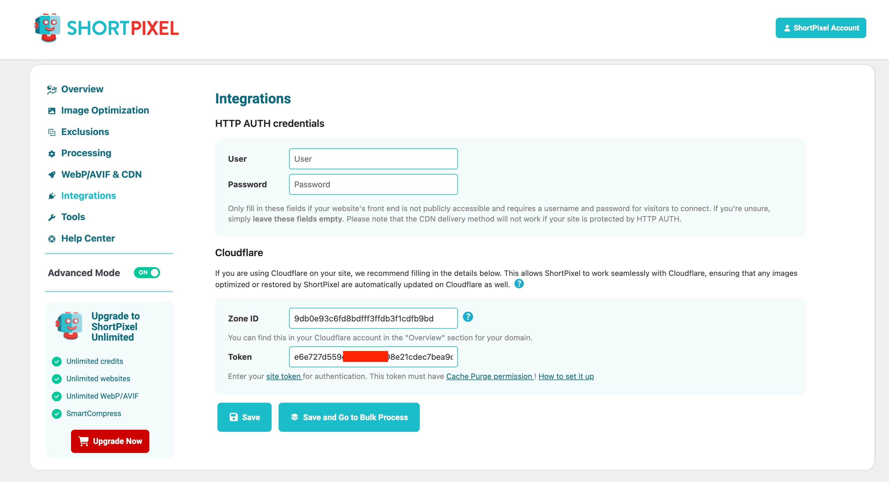
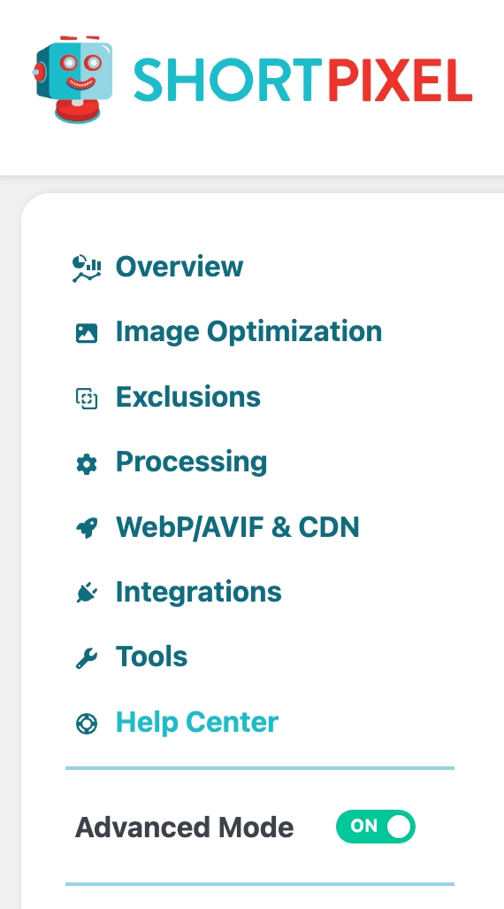
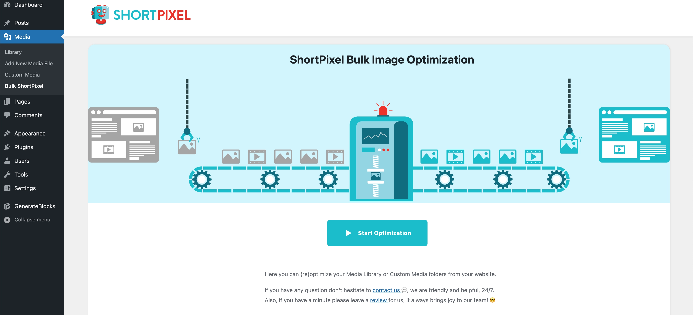

# Configuring ShortPixel Image Optimizer for WordPress

ShortPixel is a powerful image optimization plugin that can significantly improve your website's performance by reducing image file sizes without compromising quality. This guide will walk you through installing and configuring ShortPixel with optimal settings for WordPress.

## Step 1: Install ShortPixel Image Optimizer

1. Log in to your WordPress dashboard.
2. Go to **Plugins → Add New**.
3. Search for "ShortPixel Image Optimizer".
4. Click **Install Now**, then **Activate**.

## Step 2: Get a ShortPixel API Key

1. After activation, you'll be prompted to enter an API key.
2. Click on **Get API Key** to create a free ShortPixel account.
3. Complete the registration form.
4. Copy the API key provided.
5. Return to your WordPress dashboard and paste the key in the ShortPixel settings.

## Step 3: Configure Image Optimization Settings

Navigate to **Settings → ShortPixel** and configure the following settings in the **Image Optimization** tab:

### Compression Settings

- **Compression type:** **Lossy**
  - *This provides the best balance between quality and file size reduction*
- **Optimize Thumbnails:** **ON**
  - *Ensures all image sizes generated by WordPress are optimized*
- **Optimize unlisted thumbnails:** **ON**
  - *Optimizes custom image sizes created by your theme or plugins*
- **Optimize PDFs:** **ON**
  - *Reduces the size of PDF files*
- **Optimize Retina images:** **ON**
  - *Optimizes high-resolution images for Retina displays*
- **Convert PNG images to JPEG:** **OFF**
  - *Keep PNGs as they are, especially important for images with transparency*
- **CMYK to RGB conversion:** **ON**
  - *Converts CMYK images to RGB for better web compatibility*
- **Remove EXIF:** **ON**
  - *Removes metadata from images to further reduce file size*
- **Allow or prevent your images from being used for AI/ML training:** **No AI Training Flag**
  - *Adds a flag to prevent your images from being used for AI training*
- **Enable SmartCrop:** **ON**
  - *Intelligently crops images to focus on the important parts*

## Step 4: Configure Processing Settings

In the **Processing** tab, configure these settings:

- **Optimize media on upload:** **ON**
  - *Automatically optimizes images when they are uploaded*
- **Background mode:** **ON**
  - *Processes images in the background without slowing down your site*
- **Backup Originals:** **ON**
  - *Creates backups of your original images before optimization*
- **Custom Media folders:** **ON**
  - *Allows optimization of images in custom folders*

## Step 5: Configure Next Generation Images & CDN Settings

In the **Deliver Next Generation Images & CDN** tab:

- **Create WebP Images:** **ON**
  - *Creates WebP versions of your images for modern browsers*
- **Create AVIF Images:** **ON**
  - *Creates AVIF versions for even better compression in supported browsers*
- **Deliver the next generation images using the ShortPixel CDN:** **OFF**
  - *We'll serve images from our own server instead of using ShortPixel's CDN*

### Delivery Method

For **Serve WebP/AVIF images from locally hosted files**, select:
- **Using the `<PICTURE>` tag syntax → Global**
  - *This processes the whole output buffer before sending the HTML to the browser*

## Step 6: Configure Cloudflare Integration

If you're using Cloudflare (as recommended in our guide), configure the integration in the **Integrations** tab:

1. **Cloudflare Integration:** **ON**
2. **Zone ID:**
   - Enter your Cloudflare Zone ID
   - *You can find this in your Cloudflare account in the "Overview" section for your domain*
3. **Token:**
   - Enter your site token for authentication
   - *This token must have Cache Purge permission*

## Step 7: Enable Advanced Mode

In the main ShortPixel settings tab:

- **Advanced Mode:** **ON**
  - *Enables advanced features and settings for more control over image optimization*

## Step 8: Bulk Optimize Existing Images

After configuring all settings:

1. Go to **Media → Bulk ShortPixel**.
2. Click **Start Optimizing** to process all existing images.
3. The optimization will run in the background, and you can continue using your site.

## Monitoring and Maintenance

### Check Optimization Status

- Go to **Media Library** to see optimization status for individual images.
- Green indicators show optimized images, while yellow ones are pending.

### Monthly Usage

- ShortPixel offers 100 free image optimizations per month.
- For larger sites, consider purchasing additional credits or a monthly plan.
- Monitor your usage in the ShortPixel dashboard.

## Troubleshooting Common Issues

### Images Not Being Optimized

If images aren't being optimized:

1. Check your API key is valid in **Settings → ShortPixel**.
2. Ensure "Background Processing" is enabled.
3. Verify server requirements (PHP version, memory limit).

### WebP/AVIF Images Not Displaying

If next-gen images aren't showing:

1. Check browser compatibility (older browsers don't support WebP/AVIF).
2. Verify the delivery method is correctly configured.
3. Clear your browser cache and Cloudflare cache.

### Conflicts with Other Plugins

If you experience conflicts:

1. Temporarily disable other image optimization plugins.
2. Check for caching plugin conflicts and purge caches after changing settings.

## Conclusion

With ShortPixel properly configured, your WordPress site will load faster and provide a better user experience. The optimized images will also help improve your Core Web Vitals scores, particularly Largest Contentful Paint (LCP), which is crucial for SEO.

Remember to periodically check your ShortPixel dashboard to monitor usage and ensure all images are being optimized correctly. 