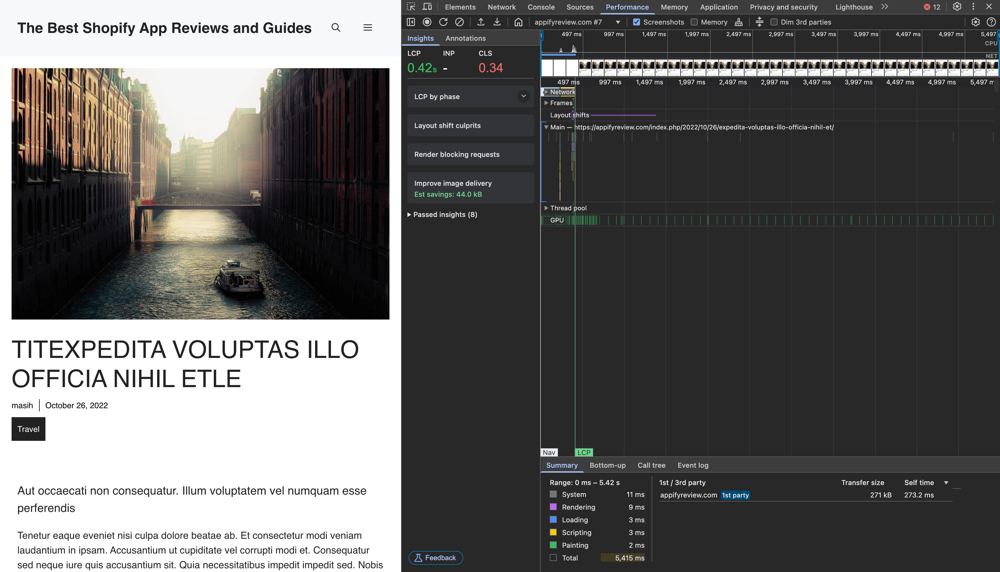
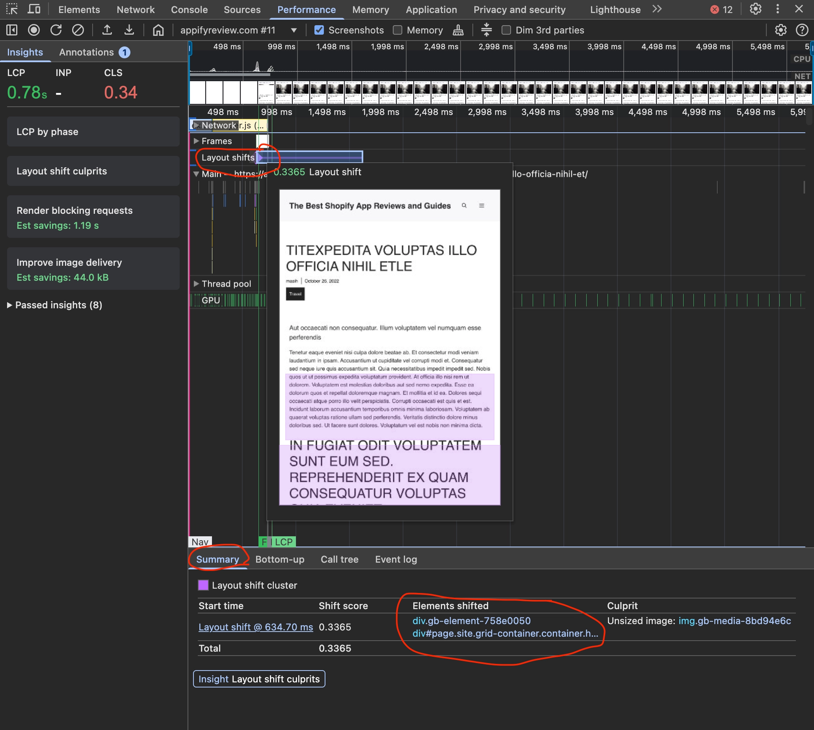
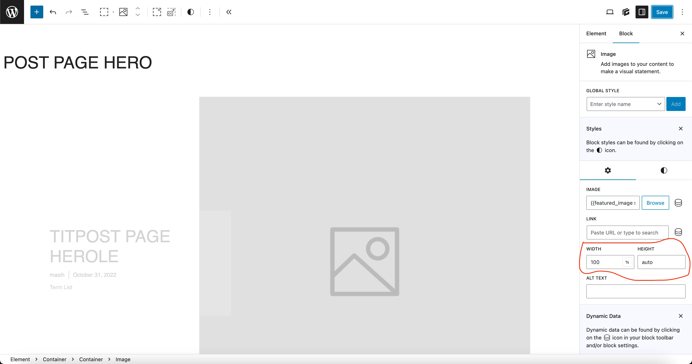

# Fixing Cumulative Layout Shift (CLS) Issues in Templates

Cumulative Layout Shift (CLS) is a Core Web Vital metric that measures visual stability. A high CLS score indicates that elements on your page are shifting unexpectedly as the page loads, creating a poor user experience. This guide will show you how to identify and fix CLS issues in pre-designed website templates.

## What Causes CLS?

Common causes of CLS include:

- Images without specified dimensions
- Dynamically injected content
- Web fonts causing FOUT (Flash of Unstyled Text)
- Animations that trigger layout changes
- Elements that resize after loading

## Step 1: Identify CLS Issues Using Chrome DevTools

1. Open your website in Google Chrome.
2. Right-click on the page and select **Inspect** or press `Ctrl+Shift+I` (Windows/Linux) or `Cmd+Option+I` (Mac).
3. Go to the **Performance** tab in DevTools.
4. Check the **Web Vitals** checkbox.
5. Click the **Reload** button (circular arrow) to record a performance profile.
6. Look for red bars labeled "Layout Shift" in the recording.

Alternatively, you can use the Layout Shift regions feature:

1. In Chrome DevTools, press `Esc` to open the bottom drawer.
2. Go to the **Rendering** tab.
3. Scroll down and check **Layout Shift Regions**.
4. Reload the page and observe areas highlighted in blue, which indicate layout shifts.

## Step 2: Identify the Specific Elements Causing Shifts

1. In the Performance recording, click on a "Layout Shift" entry.
2. In the bottom panel, you'll see a "Summary" tab showing which elements moved.
3. Note these elements for fixing.

## Step 3: Fix the Issues in WordPress

Once you've identified the problematic elements, you can fix them in WordPress:

### For GeneratePress Elements:

If you're using GeneratePress:

1. Go to **Appearance → Elements**.
2. Find and edit the specific element causing the shift.
3. In the element settings, ensure proper dimensions are set:
   - For images: Set width to 100% and height to auto
   - For containers: Set a minimum height if they load dynamic content

## Step 4: Verify Your Fixes

After implementing your fixes:

1. Return to Chrome DevTools.
2. Run another performance recording with Web Vitals enabled.
3. Verify that the layout shifts have been reduced or eliminated.
4. You can also use [PageSpeed Insights](https://pagespeed.web.dev/) to check your CLS score.

## Additional Tips for Preventing CLS

1. **Always specify dimensions for media elements:**
   - Add width and height attributes to all `` tags
   - Use aspect-ratio CSS property for responsive elements

2. **Reserve space for dynamic content:**
   - Use min-height for containers that will load content later
   - Implement skeleton screens for loading states

3. **Avoid inserting content above existing content:**
   - Place ads and banners in reserved spaces
   - Load critical content first

## Conclusion

By properly identifying and fixing CLS issues, you'll improve your site's Core Web Vitals scores and provide a better user experience. Remember that fixing CLS is not just about performance metrics—it's about creating a stable, professional-looking website that doesn't frustrate users with unexpected layout shifts.

Regular testing with tools like Chrome DevTools and PageSpeed Insights will help you maintain good CLS scores as you update your site. 