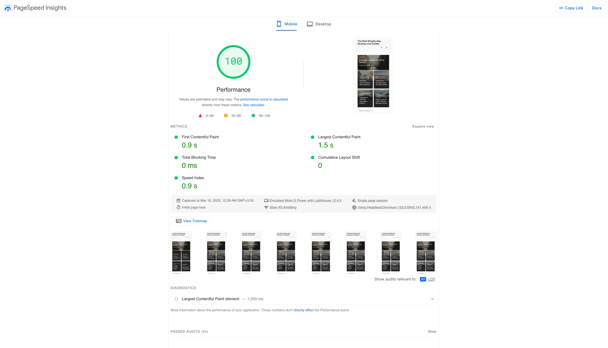

# Optimizing WordPress for Core Web Vitals and SEO (test 1)

Welcome to the ultimate guide for configuring a high-performance WordPress setup that excels in **Core Web Vitals** and **SEO**. This comprehensive documentation will walk you through every step of the process, from selecting the right hosting and server configuration to optimizing WordPress themes, plugins, and implementing advanced performance optimization techniques.

## Perfect Performance Scores Await

Following this guide will help you achieve:

- **100/100 Performance Score** in PageSpeed Insights
- Exceptional Core Web Vitals metrics:
  - **First Contentful Paint (FCP)**: 0.9s
  - **Largest Contentful Paint (LCP)**: 1.5s
  - **Total Blocking Time (TBT)**: 0ms
  - **Cumulative Layout Shift (CLS)**: 0
  - **Speed Index**: 0.9s

These metrics are well within Google's recommended thresholds, with all Core Web Vitals in the "good" range. The perfect 100/100 performance score demonstrates that our optimization approach creates websites that are not just fast, but exceptionally optimized for both user experience and search engine rankings.

## Why This Guide?

Achieving a fast, SEO-friendly WordPress site requires a holistic approach to optimization. It involves:

- **Choosing the right hosting environment**: Network speed and port quality are crucial for performance, often more so than CPU and RAM, as WordPress relies heavily on caching.
- **Optimizing server configuration**: A properly configured server stack with OpenLiteSpeed, MariaDB, and PHP is the foundation of a high-performance site.
- **Integrating Cloudflare**: Enhance performance and SEO with Cloudflare's caching, speed optimization, and security features.
- **Implementing advanced caching strategies**: LiteSpeed Cache provides powerful server-side caching that significantly reduces load times.
- **Optimizing images**: Properly configured image optimization with ShortPixel reduces page weight without sacrificing quality.
- **Fine-tuning performance**: Tools like Perfmatters help eliminate unnecessary code and optimize resource loading.
- **Using lightweight themes and frameworks**: GeneratePress provides a solid foundation for fast, SEO-friendly websites.
- **Fixing Core Web Vitals issues**: Addressing Cumulative Layout Shift (CLS) and other metrics improves user experience and SEO.
- **Ensuring security and scalability**: A secure site is a trustworthy site, and scalability ensures your site can handle traffic spikes.

## The Performance Stack

Our recommended performance stack includes:

- **Server**: OpenLiteSpeed on Ubuntu with CyberPanel
- **Database**: MariaDB with optimized configuration
- **PHP**: PHP 8.1+ with LSAPI and OPcache
- **CDN**: Cloudflare with optimized settings
- **Theme**: GeneratePress with minimal customization
- **Caching**: LiteSpeed Cache
- **Image Optimization**: ShortPixel
- **Performance Tuning**: Perfmatters

This combination provides the best balance of performance, flexibility, and ease of use for WordPress sites.

## What You'll Learn

This guide covers:

1. **Choosing the Right Hosting**: How to select the optimal hosting environment for WordPress performance.
2. **Server Configuration**: Setting up CyberPanel, OpenLiteSpeed, MariaDB, and PHP for optimal performance.
3. **Add Cloudflare and Optimize**: Configuring Cloudflare for enhanced performance and SEO.
4. **Add Website & WordPress in CyberPanel**: Steps to add a new website in CyberPanel and install WordPress.
5. **GeneratePress and Plugins**: Installing GeneratePress theme and related plugins for WordPress.
6. **Using GeneratePress Site Library**: Quickly set up professional websites using pre-designed templates.
7. **Fixing CLS Issues**: Identify and fix Cumulative Layout Shift problems for better Core Web Vitals scores.
8. **ShortPixel Image Optimizer**: Configure advanced image optimization for faster loading and better visual quality.
9. **Configuring Perfmatters**: Optimize WordPress performance by removing unnecessary code and features.
10. **LiteSpeed Cache**: Set up server-side caching for maximum performance with OpenLiteSpeed.

## Who Is This For?

This guide is for:

- **Developers** who want to build fast, SEO-friendly WordPress sites.
- **Site Owners** who want to improve their site's performance and search engine rankings.
- **Hosting Providers** looking to offer optimized WordPress hosting solutions.
- **Performance Enthusiasts** seeking to achieve perfect Core Web Vitals scores.
- **SEO Professionals** who understand the importance of site speed for rankings.

Let's get started with the **Choosing the Right Hosting**!
