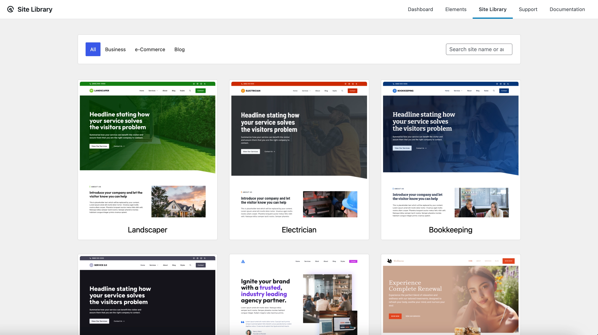
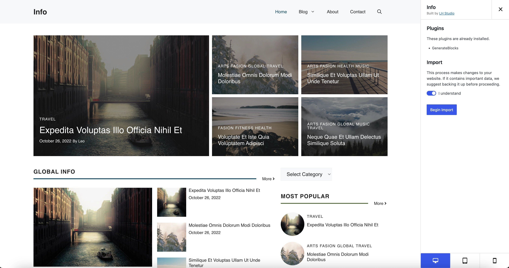

# Using GeneratePress Site Library

The GeneratePress Site Library provides pre-designed website templates that you can import with a single click. This feature is available with the GP Premium plugin and allows you to quickly set up a professional-looking website without starting from scratch.

## Prerequisites

Before using the Site Library, ensure you have:

- WordPress installed and running
- GeneratePress theme installed and activated
- GP Premium plugin installed and activated

## Step 1: Access the Site Library

1. Log in to your WordPress dashboard.
2. Navigate to **Appearance → GeneratePress**.
3. Click on the **Open Site Library →** link.

## Step 2: Browse Available Templates

The Site Library contains various templates categorized by industry or purpose:

- Business templates
- Blog templates
- Portfolio templates
- E-commerce templates
- And more

Each template includes:
- A live preview
- Information about required plugins
- A description of the template's features

## Step 3: Preview and Select a Template

1. Browse through the available templates.
2. Click on any template that interests you to see more details.
3. Click the **Preview** button to see a live demo of the template.
4. Once you've found a template you like, click the **Import** button.

## Step 4: Import the Template

1. A popup will appear showing what will be imported:
   - Theme settings
   - Customizer settings
   - Content (pages, posts, etc.)
   - Required plugins

2. You can choose to:
   - Import everything (recommended for new sites)
   - Import only the theme settings (recommended if you already have content)

3. Click **Import** to begin the process.

## Step 5: Wait for the Import to Complete

The import process may take a few minutes, depending on:
- Your server speed
- The size of the template
- The number of required plugins

Do not close your browser during this process.

## Step 6: Customize Your New Site

After the import is complete:

1. Visit your site to see the new design.
2. Go to **Appearance → Customize** to make any desired changes.
3. Edit the imported pages to replace the demo content with your own.

## Conclusion

The GeneratePress Site Library is a powerful tool for quickly setting up a professional WordPress website. By following these steps, you can have a fully designed site up and running in minutes, saving you hours of design and development time.

Remember that all templates are fully customizable, so you can use them as a starting point and then adapt them to your specific needs. 